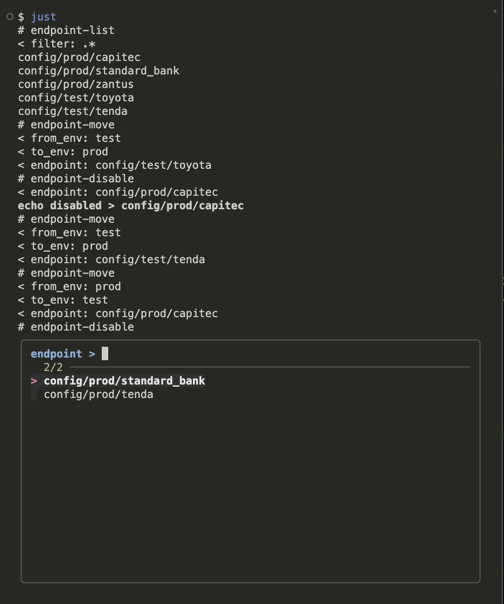

# Justfile REPL (Bash Script)

This is a simple Bash script that allows you to run a `Justfile` in a REPL-like
environment. It calls back into the `Justfile` to prompt for arguments.

### Building Prompts

The magic happens in the private recipe `prompt arg *args`. This recipe is
called by the `repl.sh` script to prompt for arguments.

- `arg` - The name of the argument to prompt for.
- `*args` - The recipe call being developed in the REPL.

The use of `set positional-arguments` is useful within a bash case statement
to set the value of the argument being prompted for.

See the contents of the `Justfile` for more a clear example.
